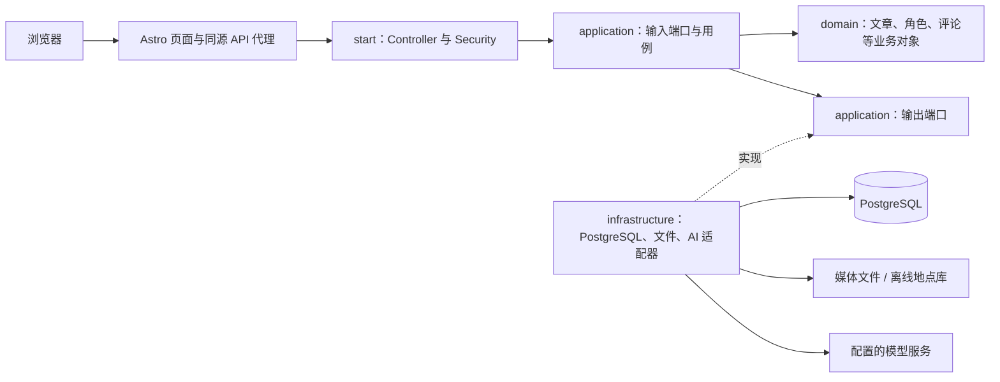
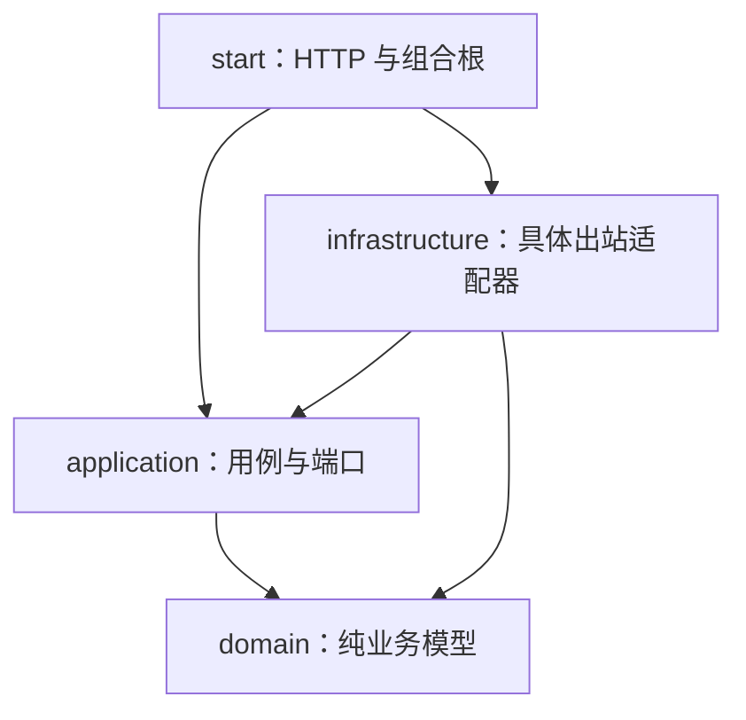

# 架构与目录地图

## 这是不是 DDD

目前采用 DDD 风格的领域建模，加上端口与适配器结构。DDD 关注业务语言、模型边界和不变量，不能仅凭四个文件夹判定；端口适配器结构让业务规则与 HTTP、数据库、模型供应商解耦。[DDD 参考手册](https://www.domainlanguage.com/wp-content/uploads/2016/05/DDD_Reference_2015-03.pdf)、[六边形架构原文](https://alistair.cockburn.us/hexagonal-architecture)。

本项目的 `Post`、`Comment`、`AgentProfile` 已有实际业务行为；模块依赖也由 Maven 和 ArchUnit 检查。业务包仍共享一个应用与数据库，还没有严格隔离的限界上下文。准确定位是“采用 DDD 的模块化单体”，不宜称为完整的战略 DDD 实现。

## 运行时：一篇文章从浏览器到数据库

用例只知道“需要保存文章”，不知道底层是 MyBatis 还是 JDBC。领域对象只知道“文章的版本必须匹配”，不知道 HTTP 409 或 SQL 锁。

## 编译依赖与运行调用不是一回事

`start` 同时引用应用接口与基础设施实现，是因为启动时必须装配它们。这个许可属于组合根，不能让 Controller 直接调用 Repository。父 POM 的 `modules` 只聚合构建，`dependencyManagement` 只管理版本，不能替代各子模块的直接依赖声明。

| 模块 | 负责 | 不应出现 |
| --- | --- | --- |
| `domain` | 不可变聚合、值对象、业务枚举、领域错误 | Spring、HTTP、SQL、PO、文件读写 |
| `application` | 用户动作编排、事务语义、输入与输出端口、Command/Query/Result | Controller、第三方 SDK、数据库 Mapper |
| `infrastructure` | PostgreSQL、Flyway、MyBatis/JDBC、MapStruct、Markdown、媒体、AI、虚拟线程、IP 库 | 发布资格、评论审核等业务决策 |
| `start` | HTTP 参数验证与 DTO、Session、Security、CSRF、定时入口、依赖装配 | Controller 直接写 SQL、复制领域生命周期 |

## 四类对象的区别

| 名称 | 中文 | 例子 | 为什么单独存在 |
| --- | --- | --- | --- |
| DO / Domain Object | 领域对象 | `Post`、`Comment` | 表达规则，不受接口或表结构影响 |
| PO | 持久化对象 | `BlogPostPo`、`ArticleVisitPo` | 表达表行、查询投影与数据库字段 |
| DTO | HTTP 请求与响应 | `CommentRequests`、`CommentResponses` | 负责 JSON、字段校验与外部兼容 |
| Command / Query / Result | 应用边界模型 | `GenerateCommentBatchCommand` | 让非 HTTP 入口也能调用相同用例 |

新结构映射用 MapStruct，在适配器层编译生成普通 Java 代码。应用把业务对象投影为自己的 Result 时保留现有显式映射；不引入对框架的依赖。访客统计是只读聚合投影，直接由数据库计算计数并返回应用结果，不必把每条访问重建成富聚合才能求和。

## 事务和版本

`TransactionRunner.required` 是应用层声明事务的接口，`SpringTransactionRunner` 用 Spring 实现。文章主行、标签、媒体引用、修订快照与归档删除共享短事务；仓储使用行锁或版本 CAS，避免覆盖别人的更新。

`version` 是客户端不应拆解的不透明令牌，当前数据库实现为 `postId:revision`。归档后的 slug 可以给新文章重用，因此只比较 slug 或一个裸数字版本不安全。

AI 调用在数据库事务之外。先用短事务验证并保存运行审计，释放连接，再等待模型，最后用另一短事务保存结果。虚拟线程没有改变这一点，也不会自动继承父线程的 Spring 事务。

`blog_post_revision` 是历史快照与审计记录；系统从活动文章行读取当前状态，没有通过重放事件构建文章，所以它不是 Event Sourcing（事件溯源）。

## 自动约束与入口

- [BackendArchitectureTests](../speaive-blog-start/src/test/java/com/speaive/blog/architecture/BackendArchitectureTests.java) 检查依赖方向、DTO/PO 边界、用例接口以及包循环。
- [AGENTS.md](../AGENTS.md) 是仓库后端约束，新增功能应先阅读。
- 配置集中在 [application.yml](../speaive-blog-start/src/main/resources/application.yml)，环境变量在根目录 [.env.example](../../.env.example)。

## 会员写作扩展

会员写作复用 `Post` 聚合，使用独立的加密载荷仓储和公开个人主页。账号设置、权限矩阵、事务流程及密钥部署见 [会员写作与内容加密](member-writing-and-encryption.md)。
