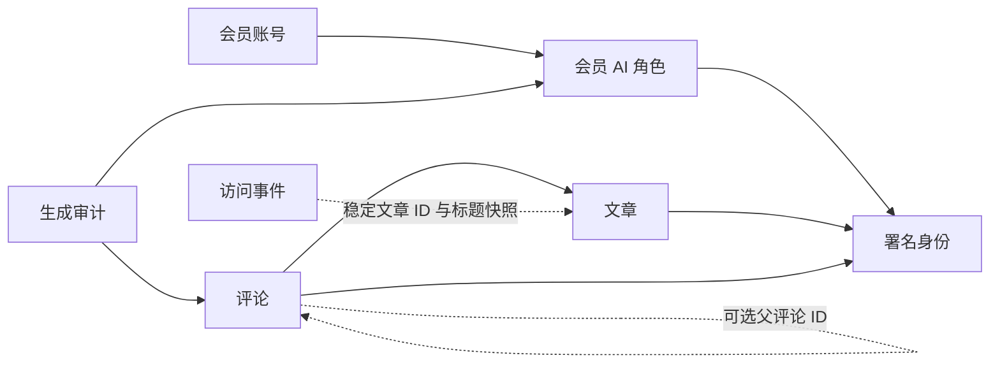
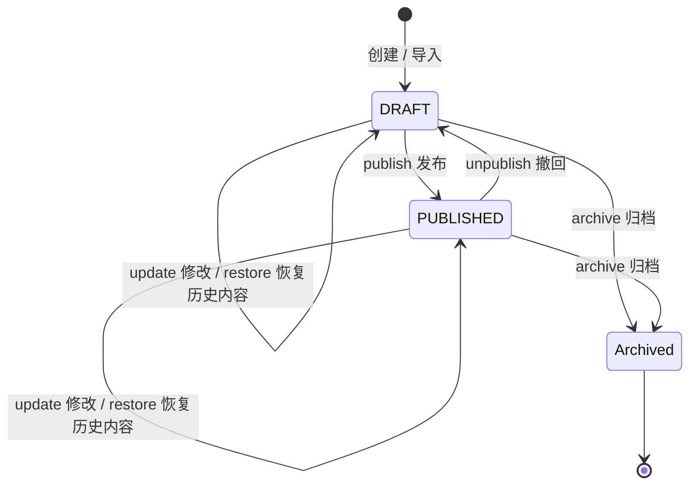
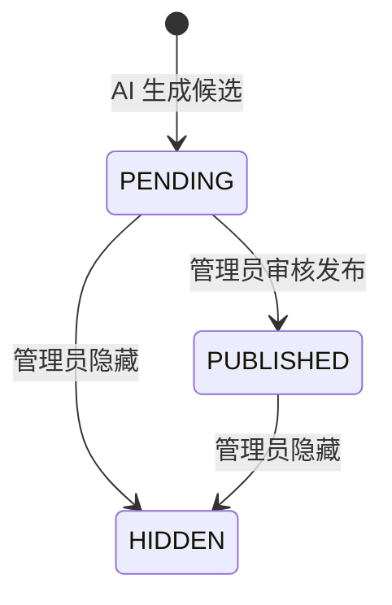

# 业务模型与状态机

## 业务词汇与边界

| 业务包 | 中文含义 | 核心对象与规则 |
| --- | --- | --- |
| `author` | 内容署名 | `Author` 是谁写的；不是密码或 HTTP 授权角色 |
| `account` | 会员账号与邀请 | `MemberAccount` 管理账号状态；`Invitation` 管理期限和可使用次数 |
| `post` | 文章 | `Post` 维护正文、状态、可见性、作者和修订 |
| `novel` | 小说片段 | `NovelFragment` 与文章各自维护发布和版本规则 |
| `agent` | AI 发言角色 | `AgentProfile` 管理提示词与资格；`AgentRun` 审计一次模型生成 |
| `comment` | 评论与回复 | `Comment` 维护作者、回复关系及审核状态 |
| `automation` | 社区自动评论 | 文章开关、角色订阅、幂等排队、重试与终止 |
| `creative` | 创作工作台 | 灵感、历史、作品集、分享、编辑建议、讨论摘要 |
| `analytics` | 公开文章访问统计 | 一次阅读是不可变事件；统计按事件计算，不代表真实个人身份 |

这些是当前单体内的业务包，不是九个独立服务。最容易混淆的关系如下：

## 文章：状态与可见性是两个维度

`DRAFT` 是草稿，`PUBLISHED` 是已发布；`PUBLIC` 是公开，`ADMIN_ONLY` 是仅自己可见。公开接口必须同时满足已发布和公开。展示用的 `publishedAt` 不能代替生命周期状态；填写过去的日期不会自动发布文章。

图中的 Archived 是生命周期说明，不是 `PostStatus` 的第三个枚举项。归档会写历史并删除活动文章行，历史快照标记归档。历史恢复是把选定历史内容应用到当前活动文章并产生新修订，不是简单把旧版本号覆盖回来。

`PostChange` 同时携带变更前快照、变更后快照和事件类型，仓储据此执行 CAS 与写历史。修改只产生一个新版本，并保持稳定 ID、slug 和作者。

## 评论：生成不等于公开

回复和顶层评论使用同一 `Comment` 模型，以可空的 `parentCommentId` 区分。没有独立的 Reply 表，也没有额外的回复状态枚举。

`ensureCanReceiveAiReply` 要求属于同一文章、父评论未隐藏、发言者是启用的 Agent，且不是父评论的作者。父评论可以暂时待审核，但回复要公开时父评论必须已经公开。隐藏一个评论时，应用用例遍历并隐藏其后续回复。当前隐藏后不提供直接重新公开操作。

## AI 角色：身份、启用意愿与审核状态不能混在一起

`ownerAccountId = null` 表示站长自建角色；非空表示会员角色。会员可以修改角色，但不能自行授予私密文章处理权限。会员改动提示词等配置会重新进入审核流程，不能只看 UI 的启用开关就判断它是否能调用模型。

- `enabledRequested`：用户希望启用。
- `reviewStatus`：站长对当前配置的审核结论。
- `identity.status`：署名身份当前是否启用。
- `canProcessPrivate`：是否允许处理私密文章；会员角色永远不能打开。
- `promptVersion`：角色配置版本，既用于乐观并发，也记录到运行审计中。

角色的 `ensureCanGenerate` 统一检查生成资格。作者的 `Author.canAuthor()` 本身只检查 ACTIVE，AI 评论等具体行为再检查 AGENT 类型。SYSTEM 是保留的署名类型，不等于管理员角色。

## 社区自动评论

文章先允许社区评论，角色还须通过审核、启用且订阅匹配的公开内容。规划器限制单篇角色数量，并按文章 ID、修订、角色等条件幂等入队。工作器领取任务后调用评论用例，成功、跳过或按退避策略重试；不是每次刷新页面重新生成。

本次管理员批量生成使用虚拟线程，现有定时任务处理循环仍逐个执行。两者的入口、队列和并发额度不同，不能把它们当成同一套调度器。

## 创作空间与读模型

`Inspiration` 负责灵感收集和推进，`WorkCollection` 负责组织文章或小说，`ShareGrant` 表达分享范围与失效条件。`EditorialReview`、`DiscussionDigest` 是模型产生的建议与讨论摘要；`ContentRevision` 是跨内容类型的历史读模型。

不是每个 record 都要人为增加生命周期。统计行、派生摘要和历史投影本来就主要用于读取；富模型的重点是让确实存在的业务决策留在领域，而不是要求所有数据类型都有十个方法。

访问事件 `ArticleVisit` 同样只追加、不修改。它保存访问时的文章标题与 slug，保留稳定文章 ID；归档或重用 slug 不会让旧访问归到新文章。设备分类的解释见 [枚举字典](enum-dictionary.md#devicetype)。

## 会员写作扩展

会员写作复用 `Post` 聚合，使用独立的加密载荷仓储和公开个人主页。账号设置、权限矩阵、事务流程及密钥部署见 [会员写作与内容加密](member-writing-and-encryption.md)。
