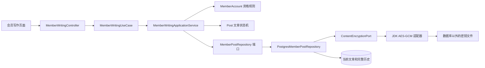
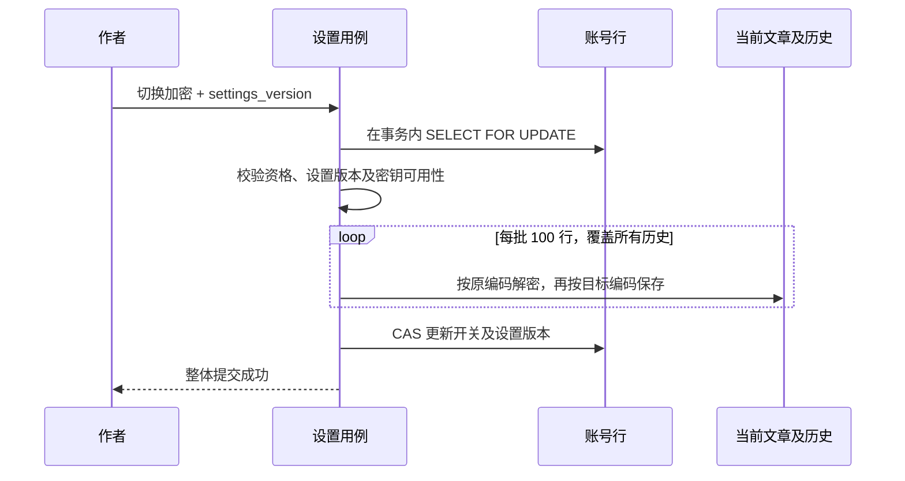

# 会员写作、个人主页与文章加密

这次扩展让受邀会员拥有自己的写作空间。站长原有的文章和管理流程保持兼容。加密是**服务器侧的数据库内容加密**：数据库查询只能看到密文，应用收到有权访问的请求后解密。它不是端到端加密；持有服务器密钥和代码权限的人在技术上仍然可以解密。

## 先怎么用

1. 站长在 `/studio/community/` 创建邀请码，朋友在 `/agents/register/` 注册。
2. 站长打开 `/studio/members/`，把朋友的身份设为“作者”，分别决定是否允许“公开发布”和“加密存储”。注册不会自动获得这些权限。
3. 作者在 `/writing/settings/` 选择“加密我的文章”。开启成功意味着当前文章及**全部历史版本，包括归档文章**都已转换；转换和账号开关一起提交。
4. 在 `/writing/` 新建文章。默认草稿、仅自己可见；保存不会自动公开。拥有发布资格后，点击“公开发布”才会出现在主页。
5. 用户名为 `kuoshao` 时，主页为 `/profile/kuoshao/`。文章地址为 `/profile/kuoshao/{随机文章标识}/`，不用私密标题生成 URL。

管理员的登录来源仍是现有配置，站长文章在 `blog_post` 中按原方式保存。无需给管理员开启或关闭会员加密。

## 三种身份和权限

| 身份 | 自己的草稿 | 新建、编辑、恢复版本 | 公开发布 | 管理其他账号 |
| --- | --- | --- | --- | --- |
| 访客 | 不可见 | 不允许 | 不允许 | 不允许 |
| 普通会员 `READER` | 可读自己的旧稿，可撤回和归档 | 不允许 | 不允许 | 不允许 |
| 作者 `WRITER` | 本人可见 | 允许 | 还需 `can_publish=true` | 不允许 |
| 站长 | 管理原有站长文章；会员接口不提供代读草稿入口 | 原有写作台 | 原有权限 | 可管理会员资格 |

- 业务资格每次请求从数据库重新读取，不把 Session 中的登录角色当成长期有效的发布许可。
- 会员内容的所有者来自认证用户名，客户端不能通过传 `ownerId` 或改 URL 获取他人的内容。读取、编辑、历史、恢复、发布、撤回、归档均限定同一个 `owner_id`。
- 收回公开发布权限会阻止新发布和公开内容更新，作者仍可撤回。收回作者身份会在同一事务中撤回其公开文章并关闭主页；以后重新开通不会自动重新发布。
- `encryption_allowed` 是站长授予的资格；`content_encrypted` 是作者自己的选择。站长不能通过取消资格，把正在加密的文章强制转为明文。
- 无登录返回 401；无操作权限返回 403；他人的内容、私密公开链接及不存在的文章统一返回 404；旧版本返回 409。

## 数据表与字段

原有 `blog_user` 存身份资料，`blog_account` 是它的一对一登录账号扩展表。加密和写作设置放在账号扩展表，避免把人类账号专属设置强加给 Agent 或系统身份。迁移为 `V11__member_writing_and_encryption.sql`。

| `blog_account` 字段 | 中文意思 | 默认值 |
| --- | --- | --- |
| `role` | 普通会员 READER / 作者 WRITER | READER |
| `can_publish` | 是否获准公开发布 | false |
| `encryption_allowed` | 是否获准使用加密存储 | false |
| `content_encrypted` | 作者是否选择加密文章 | false |
| `settings_version` | 账号设置的并发版本号 | 1 |

新表 `blog_member_post` 保存当前文章；`blog_member_post_revision` 保存每次完整修订。修订表关联账号，**不依赖当前文章行**，所以归档删除当前行后，历史仍然存在。

| 字段 | 存储方式与原因 |
| --- | --- |
| `payload` | 标题、摘要、正文、标签、封面地址、文章展示日期整体编码；普通账号为 JSON，加密账号为密文信封 |
| `payload_encrypted` | 每行自己的编码标记；读取不能仅猜测账号当前开关 |
| `id`、`owner_id`、`slug` | 明文元数据，用于所有权判断、路由和 CAS；slug 是随机 UUID |
| `status`、`visibility`、`archived` | 明文访问控制状态；加密时也参与认证，篡改后不能通过解密校验 |
| `revision`、创建/更新时间 | 明文并发与排序信息，不包含正文 |
| `event_type` | 历史修订原因：创建、修改、发布、撤回、恢复、归档 |

在会员区域，复用的 `PostVisibility.ADMIN_ONLY` 表示**仅文章本人**。这个名称来自站长文章已有协议，会员界面显示“仅自己可见”，不表示站长网页可以代读。

## 为什么独立存储，又没有复制一套状态机

原有文章链路会产生 AI 摘要、评论上下文、创作空间引用和修订副本。把会员加密正文塞进旧链路，容易在其他表留下标题或正文的明文副本。

因此新增独立的会员存储端口与适配器，同时复用原来的 `Post` 聚合及 `PostChange`：创建、修改、发布、撤回、恢复和归档仍只有一套领域规则。持久化适配器只负责保存领域已经决定的状态，不重新实现生命周期。



对应代码：

- [会员账号聚合](../speaive-blog-domain/src/main/java/com/speaive/blog/domain/account/MemberAccount.java)：资格、加密选择、账号设置版本。
- [写作用例](../speaive-blog-application/src/main/java/com/speaive/blog/application/service/MemberWritingApplicationService.java)：身份解析、账号锁、Post 状态变化和仓储调用。
- [设置用例](../speaive-blog-application/src/main/java/com/speaive/blog/application/service/WritingAccountApplicationService.java)：账号资格修改及内容批量转换的事务边界。
- [会员文章仓储](../speaive-blog-infrastructure/src/main/java/com/speaive/blog/infrastructure/content/persistence/repository/PostgresMemberPostRepository.java)：编码载荷、CAS、历史与加密转换。
- [加密实现](../speaive-blog-infrastructure/src/main/java/com/speaive/blog/infrastructure/security/AesGcmContentEncryptionAdapter.java)：标准密码库、密钥环和信封格式。
- [组合根](../speaive-blog-start/src/main/java/com/speaive/blog/MemberWritingConfiguration.java)：装配端口与实现。

## 加密与并发流程

使用 JDK 的 `AES/GCM/NoPadding`，256 位密钥、每次随机生成的 12 字节 nonce 和 128 位认证标签。信封是 `v1.密钥编号.nonce.ciphertext`，后二者使用 URL-safe Base64。版本和密钥编号也纳入认证。

附加认证数据 AAD 绑定：当前/历史类别、所属账号、文章 ID、slug、修订号、发布状态、可见范围、归档标记。同一正文的两次加密也会得到不同密文；调换账号、记录或公开状态会校验失败。使用标准认证加密与独立密钥存储的依据见 [OWASP 加密存储指南](https://cheatsheetseries.owasp.org/cheatsheets/Cryptographic_Storage_Cheat_Sheet.html)。



所有文章写入先锁同一账号行，所以转换期间不会夹入按旧设置保存的新文章。失败时全部回滚。加密转换不改变业务修订号；内容修改、发布等仍使用 `postId:revision`，旧令牌不能覆盖新版本。

缺少密钥文件时，应用可以启动，普通存储和站长文章仍可使用，但不能启用加密。存在但格式不合法的密钥文件会阻止启动。密钥丢失、未知密钥编号、密文损坏或认证失败均报错，不自动降级。

## 部署和密钥保管

在项目根目录执行：

```sh
sh scripts/setup-content-key.sh
```

脚本创建 `.secrets/content-keys.properties`，权限为 600，不输出密钥，也不会覆盖已有文件。目录、文件被 Git 和 Docker 构建上下文忽略，密钥不会打进镜像。

- 本地：`scripts/dev.sh` 和 `scripts/start.sh` 默认导出项目下密钥的绝对路径。自行运行 Java 时设置 `SPEAIVE_CONTENT_KEY_FILE=/绝对路径/content-keys.properties`。
- Docker：`SPEAIVE_CONTENT_SECRET_DIR` 指向宿主机密钥目录，只读挂载到后端 `/run/content-secrets`。前端和 PostgreSQL 容器不挂载该目录。
- 后端以 `SPEAIVE_RUNTIME_UID/GID` 运行，宿主机密钥目录需要允许这个 UID 穿越，文件需要允许它读取。典型配置可用 `chown 1000:1000 .secrets .secrets/content-keys.properties`、`chmod 700 .secrets`、`chmod 600 .secrets/content-keys.properties`；UID 必须按你的部署值调整。
- **单独备份密钥**。普通 `.data` 或 PostgreSQL 备份不包含它。丢失密钥的密文不能恢复；把数据库备份和密钥放在同一份可公开访问的备份里，会抵消隔离效果。
- 启用 HTTPS 和已有安全 Cookie 设置，传输阶段会携带解密后的文章。

密钥文件结构：

```properties
active=key-20260907
keys.key-20260907=<32 字节随机密钥的标准 Base64>
```

轮换时，保留旧 `keys.*` 条目，新增随机密钥和新的唯一编号，再将 `active` 指向新编号，原子替换受保护的文件并重启后端。新写入使用新密钥，旧内容仍能读取。作者在已开启加密的情况下再次保存设置，会把全部内容重新加密到当前 active 密钥。确认所有在线内容和需要保留的历史备份都不再依赖旧密钥前，不能删除旧条目。不要修改旧编号对应的密钥值。

开启加密不会追溯删除此前的数据库备份、WAL、磁盘旧页或已被别人复制的公开文章；历史明文备份需要单独按保留策略处理。生产环境不要开启记录正文或 SQL 参数值的调试日志。

## 当前范围

- 覆盖会员文章的全部文本载荷与修订。密码继续使用现有 BCrypt 单向哈希，不做可逆加密。
- 账号用户名、显示名、文章归属和状态等必要元数据不加密。
- 会员文章暂不接入站长的 AI 评论、创作空间、搜索/RSS、私密分享及原有访客标题副本链路，避免未经设计的明文派生。
- 编辑器支持 Markdown 文本与公开外链图片；站内媒体上传暂未对会员开放。外链图片、用户自己上传到其他网站的文件不受本功能保护。
- 私密页面、API 和个人主页响应均 `Cache-Control: no-store`；编辑器不使用 localStorage、IndexedDB 或浏览器文件保存正文草稿，保存失败保留当前表单供重试。
- 公开发布本身意味着读者可以阅读与复制；数据库加密不改变公开文章的阅读权限。

## 接口速查

| 方法与路径 | 用途 |
| --- | --- |
| `GET /api/v1/studio/members` | 管理员列出会员资格 |
| `PUT /api/v1/studio/members/{username}/permissions` | 修改身份、发布及加密资格，携带 version |
| `GET /api/v1/account/writing/settings` | 本人账号和存储设置 |
| `PUT /api/v1/account/writing/settings/encryption` | 本人切换存储，携带 encrypted、version |
| `GET/POST /api/v1/account/writing/posts` | 本人文章列表 / 新建草稿 |
| `GET/PUT /api/v1/account/writing/posts/{slug}` | 本人读取 / 修改，修改携带 version |
| `POST .../{slug}/publish、unpublish、archive` | 发布、撤回、归档，携带 version |
| `GET .../{slug}/history` | 本人的最近 50 个版本 |
| `POST .../{slug}/restore` | 恢复一个版本，携带 revision、version |
| `GET /api/v1/public/profiles/{username}` | 仅含公开已发布文章的主页，page 分页 |
| `GET /api/v1/public/profiles/{username}/posts/{slug}` | 公开文章 |

## 验证内容

领域测试验证资格与并发版本；应用假端口验证权限检查、转换顺序和失败后不保存开关；真实 PostgreSQL 测试覆盖旧库升级、两个会员的对象权限隔离、CSRF、明文/密文转换、超过 100 条修订、归档历史、CAS、并发账号锁及损坏密文的原子回滚。密码适配器测试覆盖随机 nonce、AAD、防篡改、缺失密钥和密钥轮换。原有站长接口与架构边界继续运行回归测试。
