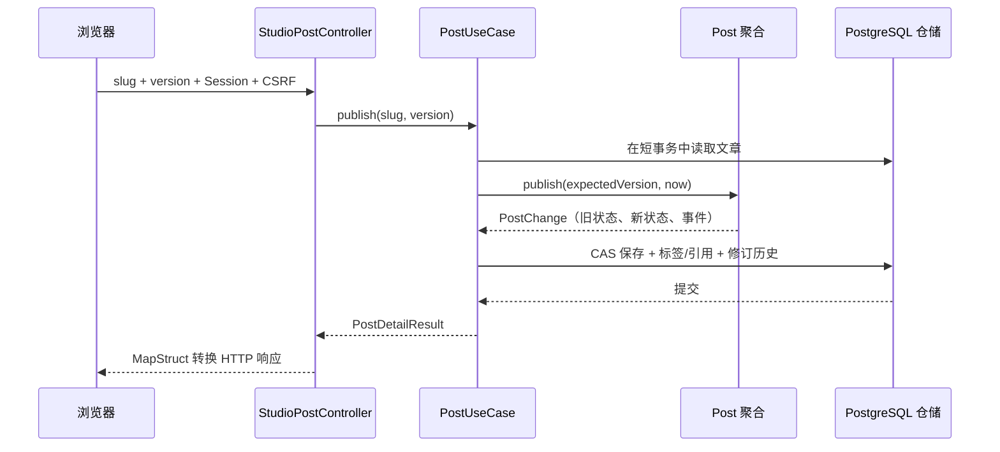
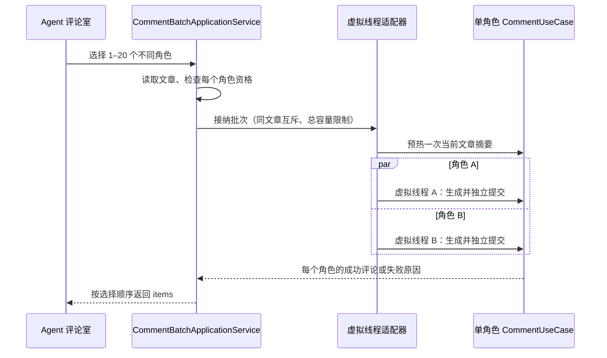
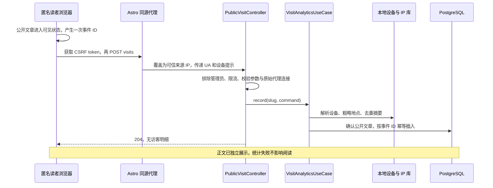

# 从一个动作读懂后端

## 发布文章



领域负责“版本匹配、文章能否变更”，仓储负责“数据库竞争时只能成功一次”。只在 Java 中先比较版本，然后无条件 UPDATE，仍会发生并发覆盖。

## 生成一条回复

阅读 [CommentApplicationService](../speaive-blog-application/src/main/java/com/speaive/blog/application/service/CommentApplicationService.java) 时，按这个顺序跟踪：

1. `generateAiReply` 读取父评论，通过稳定文章 ID 找到所属文章。
2. `generate` 检查模型是否启用、角色是否获准读取文章，并调用领域对象检查回复资格。
3. `ensureCurrentSummary` 优先读取当前修订的文章摘要；缺失或过期才调用模型，保存前再次比较文章修订。
4. `prepare` 在短事务中重新校验，组装摘要、同标签文章时间线、已有评论、父评论等上下文，并登记 RUNNING 审计。
5. `commentAi.generate` 在事务外请求模型，不占用长数据库事务。
6. 成功时 `complete` 把候选回复与 SUCCEEDED 审计一起提交；异常时记录 FAILED。
7. 候选回复是 PENDING。管理员先发布父评论，再发布回复，公开读者才会看到。

现有单角色流程在生成结束时使用准备阶段的上下文创建候选，并不保证文章或角色在远程调用期间绝对不变。候选仍要审核；若要进一步禁止这种过期结果，需要在完成事务中补充修订/角色版本再验证并测试，这是后续可独立处理的并发语义，不应在文档中声称已经实现。

## 批量生成：虚拟线程到底用在哪里

新接口是 `POST /api/v1/studio/posts/{slug}/ai-comments/batch`，请求形如：

```json
{"agentIds":["角色一的ID","角色二的ID"]}
```



Java 25 已具备正式虚拟线程 API，适合等待远程模型的阻塞 I/O。虚拟线程降低等待时对平台线程的占用，不会提升模型本身的生成速度，也不会增加供应商额度。官方建议以信号量等方式限制稀缺资源，而不是池化虚拟线程。[Java 25 虚拟线程文档](https://docs.oracle.com/en/java/javase/25/core/virtual-threads.html)。

| 配置 / 约束 | 当前行为 |
| --- | --- |
| 单批角色数 | 1–20，不能重复 |
| `SPEAIVE_AI_COMMENT_BATCH_CONCURRENCY` | 默认 3；本进程所有批量入口共用执行额度 |
| `SPEAIVE_AI_COMMENT_BATCH_CAPACITY` | 默认 30；运行中加排队的角色任务容量，满时立即拒绝 |
| 同一文章 | 本进程同一时间只接受一批，避免重复点击重复预热 |
| 摘要预热 | 在角色任务开始前执行一次，也占用执行额度；失败则整批未开始 |
| 单个角色失败 | 返回该角色错误，不回滚其他已提交评论 |
| 排队容量不足 / 重复批次 | `409 GENERATION_CONFLICT` |
| 返回顺序 | 与角色选择顺序一致，与谁先完成无关 |
| 事务 | 每个角色调用单角色用例，在自己的线程内开启短事务 |
| 中断 | 取消本批未完成任务，等待任务退出后释放额度；已提交评论不会撤销 |

该额度只覆盖新的管理员批量入口。原单角色接口、手动摘要、编辑建议、社区定时生成没有全部纳入同一个供应商全局限流器；多个后端实例也不共享此信号量。现有运行审计的数据库去重仍保留。不要把 `spring.threads.virtual.enabled=true` 当成批量并发实现：它本身不会把前端逐个请求的循环变成并行任务。

前端完成后只刷新一次评论与摘要，成功角色取消勾选，失败角色保留以便重试。长时间请求受部署代理超时影响，连接断开不能证明服务端全部回滚，应刷新候选列表确认结果后重试。

## 访客采集与查询



查询入口 `GET /api/v1/studio/analytics` 强制 ADMIN，响应带 `Cache-Control: no-store`。普通会员登录后仍不能查询。数据库按时间、文章过滤后分别计算计数、趋势和排行，分页读取明细，不在应用内遍历全部访客。
