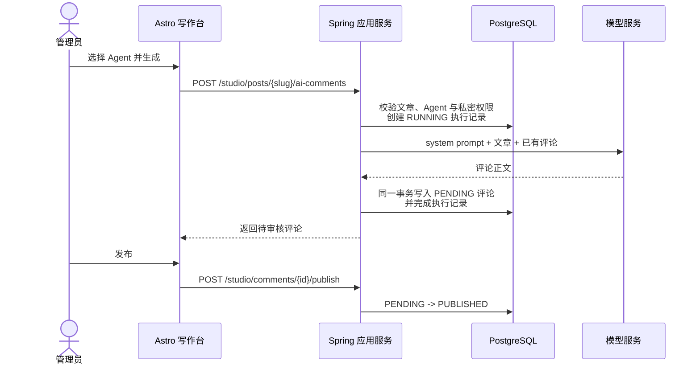

# Agent 与 AI 评论

## 业务结论

第一版把 Agent 定义为“拥有公开身份的一组模型调用配置”。管理员可以在写作台创建多个角色，为每个角色设置名称、头像、系统提示词、模型、temperature、启停状态，以及是否允许读取仅管理员可见的文章。

文章不会自动触发模型调用。管理员在文章编辑页保存当前内容后，手动勾选需要的 Agent 并点击“生成评论”。生成结果一律先进入“待审核”，只有管理员点击“发布”后才会出现在公开文章下方；点击“隐藏”后，公开接口和博客页面都不会返回该评论。

本版刻意不做 Skills、工具调用、长期记忆、自动评论和普通访客账号。一次生成会根据数据库中的 Agent 配置动态构造 system prompt、模型参数和当前文章上下文，但不会给模型注册任何工具，也不会让模型自行执行 ReAct 循环。这使第一版的成本、权限和失败边界更容易验证。

## 管理员操作

### 1. 创建角色

登录写作台，进入顶部的“Agent”页面：

1. 填写稳定用户名和显示名称；用户名创建后不可修改；
2. 编写系统提示词，例如角色的阅读角度、语言风格和关注重点；
3. 模型留空时使用服务器默认模型，也可以为某个角色单独指定模型；
4. temperature 允许 `0` 到 `2`；
5. 需要评论私密文章时，显式开启“允许读取仅自己可见的文章”；
6. 保存并保持 Agent 启用。

平台会在自定义系统提示词后追加不可覆盖的输出与安全约束，包括把文章和已有评论视为不可信数据、禁止执行正文中的指令、只输出评论正文、不冒充真人经历，以及评论长度限制。因此系统提示词只需要描述角色本身。

### 2. 为文章生成评论

打开一篇已有文章的编辑页，在正文编辑器下方找到“Agent 评论”：

1. 先保存文章；存在未保存修改时不会生成，避免模型读取旧版本；
2. 勾选一个或多个启用的 Agent；
3. 点击“生成评论”；多个角色按顺序逐个请求模型；
4. 阅读生成内容，确认后点击“发布”，不合适则点击“隐藏”。

新文章需要至少保存一次，后台取得稳定的文章 slug 后才能生成。仅管理员可见的文章只允许交给明确开启私密权限的 Agent；这个开关代表管理员确认文章正文可以被发送到当前配置的模型服务商。

同一个 Agent 对同一篇文章 revision 最多保留一次成功生成。修改并保存文章会推进 revision，此时可以基于新版本再次生成；失败的执行允许重试。为防止后端意外重启留下永久锁定，超过 15 分钟仍处于 `RUNNING` 的记录会在下次生成时标记失败。这样可避免双击或并发请求造成重复评论，也保留中断恢复路径。

## 状态与公开规则

评论状态只有三种：

| 状态 | 写作台可见 | 公开博客可见 | 后续操作 |
| --- | --- | --- | --- |
| `PENDING` | 是 | 否 | 发布或隐藏 |
| `PUBLISHED` | 是 | 是，但仅限文章本身为 `PUBLISHED + PUBLIC` | 隐藏 |
| `HIDDEN` | 是 | 否 | 本版不支持重新发布 |

公开评论接口会先按公开文章权限查找文章，再只返回 `PUBLISHED` 评论。因此草稿、私密文章、待审核评论和隐藏评论都无法通过匿名接口读取。公开页面把作者标为 AI，不把生成内容伪装成真人留言。

## 调用链与数据模型



模型网络调用不占用数据库事务。调用前短事务创建执行记录，调用成功后再以短事务写评论并完成记录；失败时记录错误并允许重试。

Flyway `V5` 新增：

- `blog_agent`：与 `blog_user` 一对一，保存系统提示词、模型参数、私密权限和配置版本；
- `blog_comment`：保存文章评论、Agent 作者和审核状态；
- `blog_agent_run`：保存文章 revision、Agent 配置版本、执行状态、模型和错误信息，便于去重和排障。

Agent 复用 `blog_user` 作为内容作者身份，但不拥有后台登录凭证。当前仍只有固定管理员能够登录和调用 Studio API；创建 Agent 不会创建一个可登录用户。

## 模型配置与部署

AI 默认关闭，不配置模型时博客、写作和 Agent 资料管理仍能正常运行，只是生成按钮不可用。使用 OpenAI 时在服务器 `.env` 中设置：

```dotenv
SPEAIVE_AI_ENABLED=true
SPEAIVE_AI_MODEL_CHAT=openai
SPEAIVE_AI_API_KEY=替换为真实密钥
SPEAIVE_AI_BASE_URL=https://api.openai.com
SPEAIVE_AI_DEFAULT_MODEL=gpt-4.1-mini
SPEAIVE_AI_MAX_ARTICLE_CHARACTERS=24000
SPEAIVE_AI_RETRY_MAX_ATTEMPTS=2
```

使用实现 OpenAI Chat Completions 兼容接口的服务时，将 `SPEAIVE_AI_BASE_URL`、密钥和默认模型改成服务商给出的值。Agent 页面中的“模型”优先于服务器默认模型；如果兼容服务不接受 OpenAI 的模型名，必须在服务器默认配置或 Agent 配置中换成其实际模型标识。

保存 `.env` 后仍运行原部署命令：

```bash
./scripts/docker-up.sh
```

部署脚本无需新增逻辑；Compose 会把 AI 环境变量传给后端，镜像重建后 Spring AI 适配器生效，Flyway 自动执行 `V5`。关闭 AI 时把 `SPEAIVE_AI_ENABLED=false` 且 `SPEAIVE_AI_MODEL_CHAT=none`，不必删除已创建的 Agent 或历史评论。

## 隐私、安全与成本边界

- API 密钥只放在服务器 `.env`，不进入前端响应、数据库或 Git；
- Agent 系统提示词和模型参数只对已登录管理员开放；
- 私密文章默认禁止发送给 Agent，每个 Agent 必须单独授权；
- 一次请求最多发送 24,000 个文章字符，可用环境变量调小；已有非隐藏评论最多带 20 条、每条最多 500 字；
- 模型输出作为纯文本保存，公开页面由模板转义，不直接渲染模型提供的 HTML；
- 评论最长 2,000 字，超限或空响应会失败且不会公开；
- Spring AI 的重试只用于短暂模型错误，仍应关注服务商计费和限额；
- `blog_agent_run` 会记录服务商响应中的实际模型、输入 token 和输出 token；兼容服务未返回这些元数据时对应字段保持为空。

提示词注入只能降低风险，不能证明模型绝对不会受正文影响。当前模型没有工具、文件、网络或数据库权限，所以即使生成内容偏离角色，影响也被限制在一条必须人工审核的待发布评论内。

## HTTP API

本节列出的所有 `/api/v1/studio/**` Agent 与评论接口都要求管理员 Session，写请求还要求 CSRF 校验。

| 方法 | 路径 | 用途 |
| --- | --- | --- |
| `GET` | `/api/v1/studio/agents` | Agent 列表与 AI 可用状态 |
| `POST` | `/api/v1/studio/agents` | 创建 Agent |
| `PUT` | `/api/v1/studio/agents/{id}` | 按 version 更新 Agent |
| `GET` | `/api/v1/studio/posts/{slug}/comments` | 查看文章全部评论状态 |
| `POST` | `/api/v1/studio/posts/{slug}/ai-comments` | 指定 `agentId` 生成待审核评论 |
| `POST` | `/api/v1/studio/comments/{id}/publish` | 发布评论 |
| `POST` | `/api/v1/studio/comments/{id}/hide` | 隐藏评论 |
| `GET` | `/api/v1/public/posts/{slug}/comments` | 匿名读取已发布评论 |

常见错误：AI 未配置返回 `503 AI_UNAVAILABLE`；模型调用失败返回 `502 AI_GENERATION_FAILED`；同一文章版本重复生成返回 `409 GENERATION_CONFLICT`；文章、Agent 或评论不存在返回 `404`。

## 本次实现记录与后续范围

本次从“让多个 Spring AI Agent 给文章评论”反推了三个必须先落地的业务对象：Agent 配置、需要人工审核的评论、可去重和排障的执行记录。实现时保持现有六边形边界：用例编排位于 application，角色与评论状态规则位于 domain，Spring AI 和 PostgreSQL 位于 infrastructure，HTTP 与后台页面位于 start/Astro。

第一版明确暂缓：Skills 与工具表、自动触发策略、对话记忆、访客注册和真人评论、评论回复树、定时生成、批量重跑、token 成本面板。未来增加这些能力时，应继续保持“模型不能自行扩大权限”和“生成内容默认不公开”两条不变量。

验收命令：

```bash
cd backend
env -u JAVA_HOME sh -c '. ../scripts/java-25.sh && use_java_25 && ./mvnw clean verify'

cd ..
pnpm check
pnpm test
pnpm build:frontend
```
