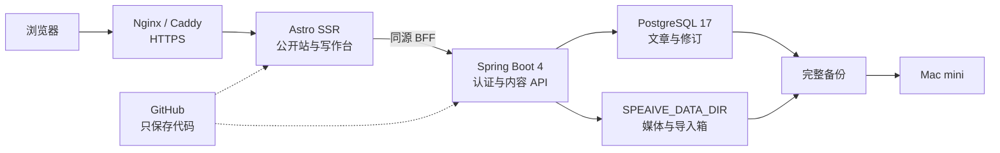
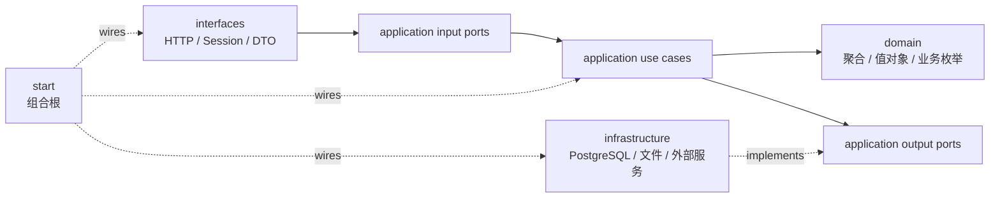

# 技术架构

## 结论

Speaive Blog 采用 **Astro SSR + Spring Boot 模块化单体 + PostgreSQL + 服务器媒体目录**。GitHub 只保存程序代码；文章在 PostgreSQL，图片和 Markdown 投递箱在代码仓库之外的 `SPEAIVE_DATA_DIR`。



浏览器只访问 Astro，不直接访问 Spring Boot 或 PostgreSQL。Astro 服务端请求公开 API，并将 `/api/v1` 与 `/media` 同源转发给 Spring Boot，因此不需要跨域配置。

## 后端模块

后端是一个部署单元，Maven 模块只约束代码边界：



- `domain`：聚合、实体、值对象、领域服务和业务枚举，不依赖框架；
- `application`：创建、更新、发布、撤回、归档等用例及 input/output ports；
- `infrastructure`：output port 的实现，以及 MyBatis-Plus、Flyway、Markdown 和媒体文件能力；
- `interfaces`：input port 的 HTTP/定时投递箱入站适配器、DTO、Session 登录、CSRF 和登录限流；
- `start`：唯一运行入口和组合根，只负责配置与依赖装配。

正常调用只跨相邻边界：`interfaces -> application -> domain`，I/O 通过 `application -> output port <- infrastructure` 反转依赖。`start` 为完成组合根职责可以依赖全部模块，这是唯一例外；Controller 不得直连 Mapper，application 不得引用 PO 或具体适配器，domain 不得引用外层类型。

### 领域模型与映射

新增和重构的业务以富聚合为目标。文章的状态变化和业务不变量应由聚合根维护，application 负责用例编排，适配器只负责协议和技术细节。业务枚举属于 domain；数据库和 HTTP 需要稳定字符串值时，在适配层显式映射，不用魔法字符串替代领域类型。

模型按边界分开：PO 只描述 infrastructure 的持久化结构，DO 是 domain 的聚合、实体和值对象，DTO 只描述 interfaces 的外部协议，application 使用 Command/Query/Result。新增或重构的结构映射统一使用 MapStruct，业务决策不写入映射表达式。当前代码仍有手工映射，这是一条渐进实施规则，不表示现有映射已经全部迁移。

每个对外用例由 application input port 表达；数据库、文件、时钟以及未来的 AI/向量服务由 output port 表达。HTTP、定时任务和后续消息消费者都属于入站适配器，只能调用 input port。

未来接入 Spring AI 时，模型与向量存储适配器放在 `infrastructure`，生成、润色和检索流程放在 `application`，不改变现有前后端边界。

## 数据边界

PostgreSQL 是文章的唯一真源：

- `blog_user` 保存可作为文章作者、评论者的内容身份；当前内置固定 `admin`，它不保存登录密码；
- `blog_post` 保存当前草稿或已发布文章；
- `blog_post_tag` 保存有序标签；
- `blog_post_revision` 与对应标签表保存每次创建、更新、状态变更和归档快照；
- `blog_media` 保存媒体路径、类型、大小和校验值；
- `blog_markdown_import` 记录已导入文件的 SHA-256，避免重复导入。

每次写操作都使用递增 revision 和 `id + slug + revision` 条件做数据库 CAS。创建、更新、发布、撤回和归档各推进一次 revision；两个页面同时编辑或归档后重用 slug 时，旧 version 会得到 `409 VERSION_CONFLICT`，不会覆盖新的正文或发布状态。HTML 不入库，由后端从 Markdown 实时渲染和过滤。

文章主记录、标签、修订快照和归档删除属于同一个事务边界，任一步失败都必须回滚。数据库和媒体文件是双资源操作，上传失败时需要补偿已写文件，读取时继续校验 MIME、大小和 SHA-256。事务语义跟随 application 用例，具体 Spring 事务和补偿实现留在 infrastructure 或 `start`，不进入 domain。

活动文章和每条修订快照都通过不可级联删除的 `author_id` 引用 `blog_user`。V2 迁移会把已有文章及仅剩修订记录的已归档文章统一回填给固定 `admin`。网页创建、Markdown 上传和后台投递箱导入都由服务端指定作者，请求正文和 Markdown frontmatter 不能冒充作者。未来 AI Agent 复用 `blog_user` 作为公开身份，登录凭证仍应放在独立账号表中。

PostgreSQL 镜像预装并启用 `pgvector` 扩展，当前不创建向量业务表；等 Spring AI 功能确定后再独立迁移文章分块和 embedding 表。

服务器目录只保存非结构化文件：

```text
SPEAIVE_DATA_DIR/
├── media/              # 写作台上传的图片
└── inbox/              # Markdown 导入箱
    ├── imported/       # 已成功导入或去重的源文件
    └── rejected/       # 无法导入的文件和原因
```

导入箱不是第二套内容源。后端把 `.md` 校验并写入 PostgreSQL 后才会出现在写作台，随后将源文件移到 `imported/`。

## 运行与安全边界

- Compose 只将 Astro 的 `4321` 绑定到宿主机 `127.0.0.1`；后端和数据库没有宿主机端口；
- 公网只经过 Nginx/Caddy 的 HTTPS 入口；
- Astro BFF 限制请求体为 9 MiB、流式转发，并清洗后重建可信客户端 IP；
- 写作台使用单管理员 Session、BCrypt、CSRF 和登录失败限流；
- 数据库结构只由 Flyway 迁移，MyBatis-Plus 不负责自动建表。

Flyway 迁移只追加、不修改已发布版本；每次迁移同时验证空库安装和带真实旧数据升级。CAS、事务、迁移和 SQL 方言统一使用 PostgreSQL 17 Testcontainers 测试，不以 H2 替代。后端测试命令是：

```bash
cd backend
env -u JAVA_HOME sh -c '. ../scripts/java-25.sh && use_java_25 && ./mvnw test'
```

## 已知取舍

- 当前认证仍是单管理员后台，不提供注册、多用户登录、角色授权和审核流；`blog_user` 仅提供可扩展的内容身份；
- Session 存在单个后端进程内，容器重启后需要重新登录；
- 媒体仍在单机文件系统，扩展为多实例前需要迁移到对象存储；
- 完整恢复必须同时使用 PostgreSQL dump 和 `SPEAIVE_DATA_DIR`，只复制其中一部分不算有效备份。
