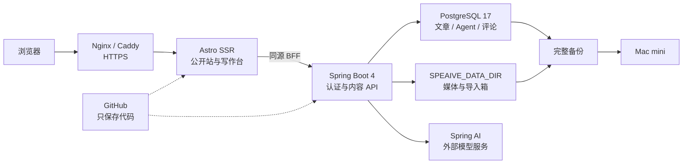
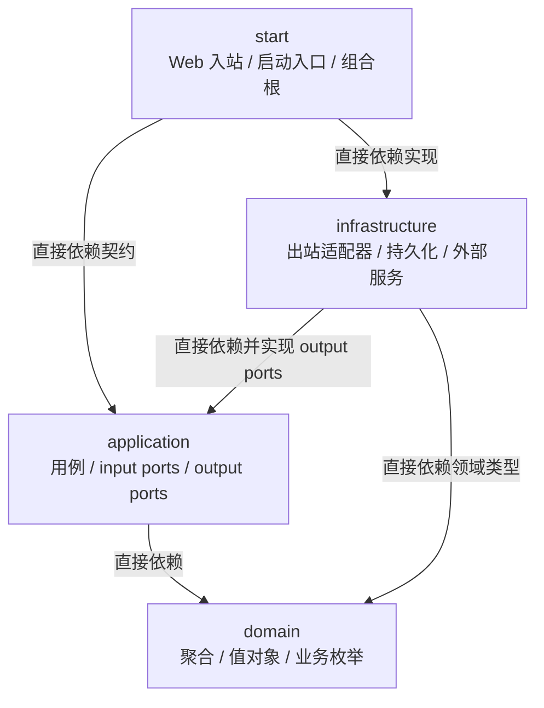

# 技术架构

## 结论

Speaive Blog 采用 **Astro SSR + Spring Boot 模块化单体 + PostgreSQL + 服务器媒体目录**。GitHub 只保存程序代码；文章在 PostgreSQL，图片和 Markdown 投递箱在代码仓库之外的 `SPEAIVE_DATA_DIR`。



浏览器只访问 Astro，不直接访问 Spring Boot 或 PostgreSQL。Astro 服务端请求公开 API，并将 `/api/v1` 与 `/media` 同源转发给 Spring Boot，因此不需要跨域配置。

## 后端模块

后端是一个部署单元，Maven 模块只约束代码边界：



- `domain`：聚合、实体、值对象、领域服务和业务枚举，不依赖框架；
- `application`：创建、更新、发布、撤回、归档等用例及 input/output ports；
- `infrastructure`：分别直接依赖 `application` 和 `domain`，并实现 application output ports，负责 PostgreSQL、MyBatis-Plus、PO、SQL、Flyway、数据库驱动、Markdown、媒体文件和第三方服务；
- `start`：HTTP/定时投递箱入站适配器、DTO、Session、Security、CSRF 和登录限流，也是唯一运行入口与组合根。入站适配器继续使用 `com.speaive.blog.interfaces` 包名，但它只是 `start` 内的包，不是第五个 Maven 模块。

上图表达的是 Maven 构建依赖，不是业务调用链。正常业务调用是 `start/com.speaive.blog.interfaces -> application -> domain`，I/O 通过 `application -> output port <- infrastructure` 反转依赖。`start` 同时直接依赖 `application` 契约和 `infrastructure` 实现，是组合根完成 Bean 装配所必需的双依赖，不是业务代码跨层；严禁删除 `start -> application` 后利用 Maven 传递依赖伪造 `start -> infrastructure -> application` 单链。

`infrastructure` 源码直接使用 application 契约与 domain 类型，因此对两者都声明直接 Maven 依赖；不得依靠 `application -> domain` 的传递依赖编译。该依赖只反映源码类型引用，不改变正常业务调用与 output port 依赖倒置方向。

`start` 中的 Controller、Security 和定时入口只能调用 application input port，不得直接调用 Mapper、Repository 实现或 output port。application 不得引用 PO 或具体适配器，domain 不得引用外层类型。

### 领域模型与映射

新增和重构的业务以富聚合为目标。文章的状态变化和业务不变量应由聚合根维护，application 负责用例编排，适配器只负责协议和技术细节。业务枚举属于 domain；数据库和 HTTP 需要稳定字符串值时，在适配层显式映射，不用魔法字符串替代领域类型。

模型按边界分开：PO、SQL、Flyway 迁移和数据库驱动只属于 infrastructure，DO 是 domain 的聚合、实体和值对象，DTO、HTTP 与 Security 只属于 start 的入站适配器，application 使用 Command/Query/Result。新增或重构的结构映射统一使用 MapStruct，业务决策不写入映射表达式。当前代码仍有手工映射，这是一条渐进实施规则，不表示现有映射已经全部迁移。

每个对外用例由 application input port 表达；数据库、文件、时钟以及 AI/向量服务由 output port 表达。HTTP、定时任务和后续消息消费者都属于入站适配器，只能调用 input port。

当前 Spring AI `ChatModel` 适配器放在 `infrastructure`，Agent 评论生成和审核流程放在 `application`，Agent/评论状态规则放在 `domain`，没有改变现有前后端边界。向量存储尚未启用，后续检索功能仍应通过独立 output port 接入。

## 数据边界

PostgreSQL 是文章的唯一真源：

- `blog_user` 保存可作为文章作者、评论者的内容身份；当前内置固定 `admin`，它不保存登录密码；
- `blog_post` 保存当前草稿或已发布文章；
- `blog_post.visibility` 将“内容状态”和“谁可读取”分离，新文章默认仅管理员；
- `blog_post_tag` 保存有序标签；
- `blog_post_revision` 与对应标签表保存每次创建、更新、状态变更和归档快照；
- `blog_media` 保存媒体路径、类型、大小和校验值；
- `blog_post_media` 保存文章实际引用的媒体，用于阻止私密正文图片从匿名地址泄露；
- `blog_markdown_import` 记录已导入文件的 SHA-256，避免重复导入。
- `blog_agent` 保存 Agent 的系统提示词、模型参数、私密内容授权和配置版本；
- `blog_comment` 保存由 Agent 创建、经管理员审核的文章评论；
- `blog_agent_run` 保存每次模型调用的文章版本和执行结果，用于去重、失败记录与后续成本审计。

每次写操作都使用递增 revision 和 `id + slug + revision` 条件做数据库 CAS。创建、更新、发布、撤回和归档各推进一次 revision；两个页面同时编辑或归档后重用 slug 时，旧 version 会得到 `409 VERSION_CONFLICT`，不会覆盖新的正文或发布状态。HTML 不入库，由后端从 Markdown 实时渲染和过滤。

文章主记录、标签、修订快照和归档删除属于同一个事务边界，任一步失败都必须回滚。数据库和媒体文件是双资源操作，上传失败时需要补偿已写文件，读取时继续校验 MIME、大小和 SHA-256。事务语义跟随 application 用例，具体 Spring 事务和补偿实现留在 infrastructure 或 `start`，不进入 domain。

活动文章和每条修订快照都通过不可级联删除的 `author_id` 引用 `blog_user`。V2 迁移会把已有文章及仅剩修订记录的已归档文章统一回填给固定 `admin`。网页创建、Markdown 上传和后台投递箱导入都由服务端指定作者，请求正文和 Markdown frontmatter 不能冒充作者。AI Agent 复用 `blog_user` 作为公开身份，但不拥有登录凭证；后台仍只有管理员 Session。

PostgreSQL 镜像预装并启用 `pgvector` 扩展，当前 AI 评论不使用向量检索，也不创建向量业务表；后续需要文章检索时再独立迁移分块和 embedding 表。

服务器目录只保存非结构化文件：

```text
SPEAIVE_DATA_DIR/
├── media/              # 写作台上传的图片
└── inbox/              # Markdown 导入箱
    ├── imported/       # 已成功导入或去重的源文件
    └── rejected/       # 无法导入的文件和原因
```

导入箱不是第二套内容源。后端把 `.md` 校验并写入 PostgreSQL 后才会出现在写作台，随后将源文件移到 `imported/`。

## 运行与安全边界

- Compose 只将 Astro 的 `4321` 绑定到宿主机 `127.0.0.1`；后端和数据库没有宿主机端口；
- 公网只经过 Nginx/Caddy 的 HTTPS 入口；
- Astro BFF 限制请求体为 9 MiB、流式转发，并清洗后重建可信客户端 IP；
- 写作台使用单管理员 Session、BCrypt、CSRF 和登录失败限流；
- 公开文章查询必须同时满足 `PUBLISHED + PUBLIC`；私密文章和媒体只能从已认证的 Studio 接口读取；
- AI 评论默认关闭；私密文章只有在 Agent 被单独授权后才能发送给外部模型，模型输出必须经管理员审核才公开；
- 数据库结构只由 Flyway 迁移，MyBatis-Plus 不负责自动建表。

Flyway 迁移只追加、不修改已发布版本；每次迁移同时验证空库安装和带真实旧数据升级。CAS、事务、迁移和 SQL 方言统一使用 PostgreSQL 17 Testcontainers 测试，不以 H2 替代。后端测试命令是：

```bash
cd backend
env -u JAVA_HOME sh -c '. ../scripts/java-25.sh && use_java_25 && ./mvnw test'
```

## 已知取舍

- 当前需求只有“公开”和“仅自己”，因此认证仍是单管理员后台，不提供注册、多用户登录、邀请码和审核流；`blog_user` 仅提供可扩展的内容身份；若以后增加指定读者，再引入由管理员发放邀请码的注册流程；
- Session 存在单个后端进程内，容器重启后需要重新登录；
- 媒体仍在单机文件系统，扩展为多实例前需要迁移到对象存储；
- 完整恢复必须同时使用 PostgreSQL dump 和 `SPEAIVE_DATA_DIR`，只复制其中一部分不算有效备份。
