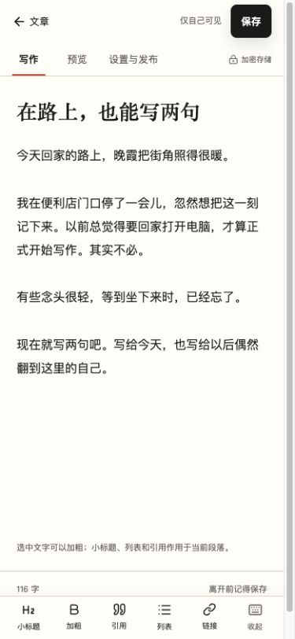

# 手机写作体验：问题、实现与验收

本轮针对会员写作 `/writing/`，在本地测试账号上实际操作输入、选区排版、预览、设置、保存和断网恢复。没有改动线上内容、后端接口、发布权限或加密存储规则。

## 体验中发现的问题

- 390 × 844 的浏览器窗口中，旧版正文约从页面 460 px 处开始：导航、保存与发布、标签栏和固定高度标题挤占了首屏。
- 正文字号为 14 px；长文在 textarea 内滚动，外层页面也滚动，难以判断当前在移动什么。
- 标签、摘要和历史记录排在正文之后；手机上要翻很久才能修改。
- 缺少可点按的常用排版工具，作者需要自己输入 Markdown 符号。
- 预览期间新增提示条会改变页面高度，返回写作时原来的位置被挤偏。

## 现在的交互

手机写作页只保留两行顶部操作：返回文章列表、保存状态与保存；下一行是写作、预览、设置与发布。账号导航仍在文章列表中。公开发布放在设置里，仍需明确确认。

正文使用原生 textarea，标题和正文按实际内容调整高度，长文只滚动页面。正文 16 px，手机端排版工具每个至少 48 px 高。小标题、加粗、引用、列表、链接均在底部直接操作，最后一个按钮用于收起键盘。大屏保留设置侧栏。

排版保留选区，不在中文输入法组词期间重写文本。插入链接使用独立弹窗，允许修改名称和完整网址，取消后回到原选区。网页链接限制为不带凭据的 HTTP/HTTPS，并转义 Markdown 控制符。

预览调用原有的无副作用接口，不保存或发布文章。返回写作恢复滚动位置，不主动弹出键盘。表单校验发现标签等设置错误时，自动打开正确视图再定位，不会对隐藏控件尝试聚焦。

顶部明确显示未保存、正在保存和失败状态。误点编辑器内的返回按钮时可以取消离开。断网、登录过期和版本冲突仍沿用原有保护，不清空输入、不自动覆盖服务器版本。

## 代码入口

| 文件 | 职责 |
| --- | --- |
| `src/components/WritingEditor.astro` | 写作、预览、设置结构和排版工具 |
| `src/components/WritingLinkDialog.astro` | 链接输入弹窗 |
| `src/lib/writing/editor.ts` | 原有保存、权限、版本与发布流程；校验时定位视图 |
| `src/lib/writing/mobile-editor.ts` | 视图切换、滚动恢复、输入高度、可视区域适配、选区与输入法处理 |
| `src/lib/writing/markdown.ts` | 不依赖 DOM 的选区变换和链接构造 |
| `src/styles/mobile-writing.css` | 编辑页的小屏布局，断点为 800 px |
| `tests/writing-markdown.test.ts` | 中文、emoji、空段落、多行选区、重复操作和链接校验 |

## 实测结果

- 浏览器窗口 390 × 844、320 × 568：无整页横向溢出；最窄窗口的正文区域实际宽度为 305 px，六个排版按钮宽度约 48 px。
- 长文正文 `clientHeight === scrollHeight`，正文自身 `scrollTop === 0`，顶部操作随页面滚动保持可见。
- 选中文本加粗、跨行列表、系统撤销、链接插入和取消均通过界面操作验证。
- 预览前后的页面滚动位置都为 888 px，文章内容和未保存状态保持正确。
- 21 个标签触发校验，自动切到设置并定位标签；改正后可以保存。
- 误点返回：出现未保存确认，取消后留在当前稿件。
- CDP 模拟断网保存：显示连接中断，输入完整保留；恢复网络重试成功。测试结束已恢复正常网络。
- 390 × 430 小高度窗口：链接弹窗输入和提交按钮可见。
- `pnpm test`：78 项通过；`pnpm run build:frontend`：构建通过。类型检查无错误、无警告，有一项下述兼容 API 的弃用提示。

## 边界和后续

本轮是桌面浏览器的手机尺寸实操，不是真机验收。仍需在 iOS Safari 和安卓 Chrome 上检查真实软键盘弹出、拼音候选、长按选择、工具栏跟随键盘、横竖屏切换和系统撤销。小高度窗口不能替代真机输入法测试。

键盘遮挡处理采用 [VisualViewport](https://developer.mozilla.org/en-US/docs/Web/API/VisualViewport) 的可视高度和偏移量。链接弹窗也随可视区域调整位置和最大高度；页面缩放不按键盘处理，保留用户缩放能力。

为了保留原生撤销记录，排版插入优先使用 `execCommand("insertText")`，不支持时降级为 `setRangeText`。[MDN 说明其已弃用，但直接替换 DOM 尚无等价的原生撤销保留能力](https://developer.mozilla.org/en-US/docs/Web/API/Document/execCommand)。浏览器降级路径不保证保留系统撤销栈，应在真机回归中覆盖。

保存仍需主动点击；当前页面关闭或被系统回收时，不保证保留未保存输入，也不把私密正文写进浏览器本地缓存。后续自动保存必须先处理公开稿与修改稿分离。

会员手机相册上传尚未提供。已有图片上传属于管理员接口，不能直接放开给会员；后续需要结合图片归属、访问权限和私密文章的存储方案一起设计。
